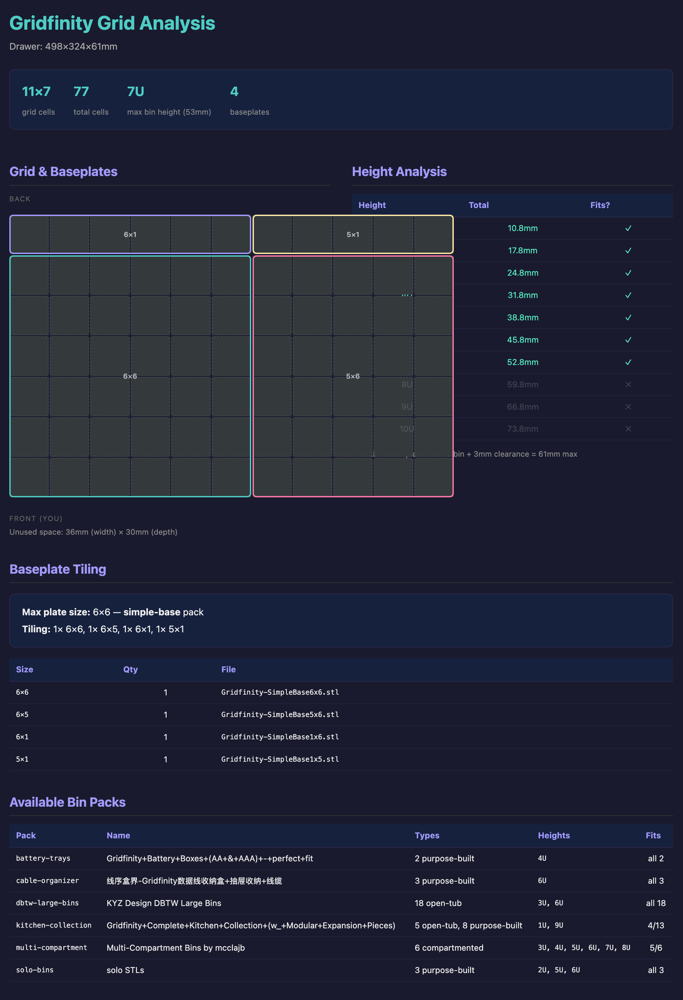
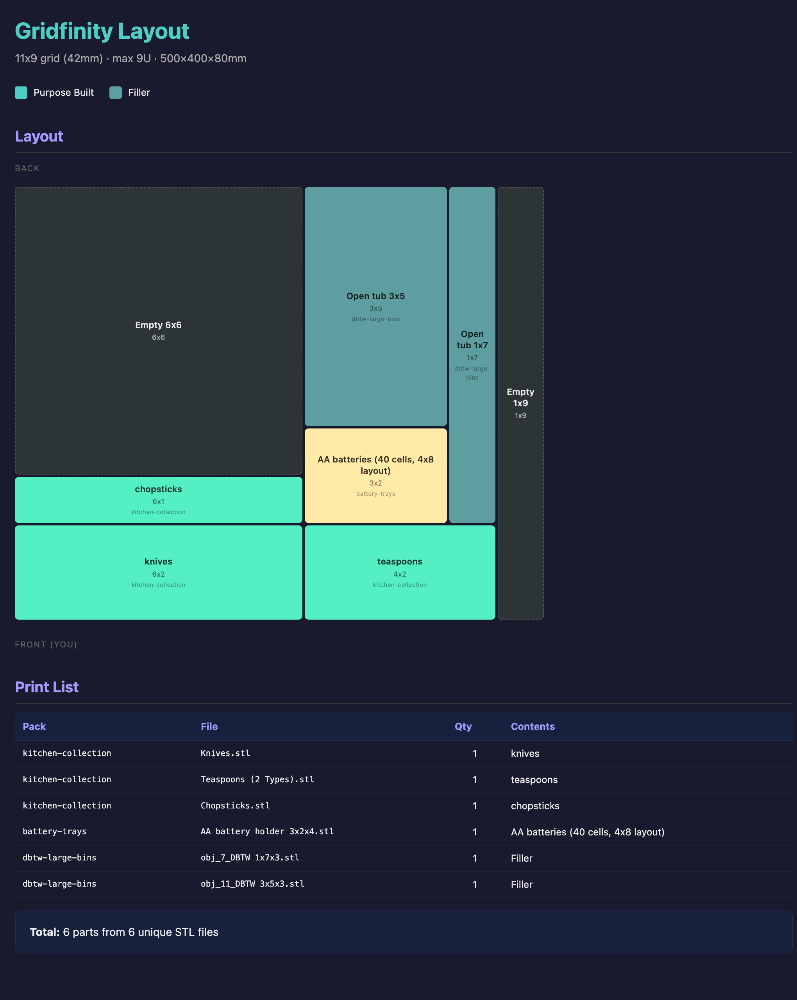

# Gridfinity Drawer Organizer

A CLI tool for planning Gridfinity drawer organizer layouts and exporting them as print-ready .3mf files for Bambu Studio.

There are thousands of Gridfinity bins on MakerWorld — open tubs, utensil holders, battery trays, cable organizers — but no good way to plan how they all fit together in a specific drawer. This tool solves that. Tell it your drawer dimensions and what goes in it, and it figures out which bins to use, where they go, what baseplates you need, and produces a .3mf with everything arranged on print plates.

**No STL files are included in this repo.** You download bins from MakerWorld yourself (they're CC-BY-NC-SA). This tool ships pack manifests — JSON metadata that describes each bin's grid dimensions, type, and purpose — so the placement engine knows what's available without needing to redistribute the models.

Zero dependencies. Pure Node.js (v18+).

## Installation

Clone and optionally link so the tools are available from any directory:

```sh
git clone https://github.com/dimatosj/gridfinity-drawer-organizer.git
cd gridfinity-drawer-organizer
npm link   # adds "gridfinity-*" commands to your PATH
```

Or just run tools directly with `node src/<tool>.js`.

## Designed for Claude Code

This tool is built to be driven by [Claude Code](https://docs.anthropic.com/en/docs/claude-code). Rather than memorizing CLI flags and JSON schemas, you describe your drawer and what goes in it in plain English — Claude reads the CLAUDE.md instructions and runs the full pipeline for you:

> "I have a kitchen drawer that's 500mm wide, 400mm deep, and 80mm tall. I want to organize knives, chopsticks, teaspoons, and AA batteries."

Claude will:
1. Run the grid analysis and show you what fits
2. Match your items to purpose-built bins from the catalog
3. Show you the layout preview and ask for feedback
4. Iterate on placement until you're happy
5. Export the .3mf and print checklist

You can also run every step manually from the command line — see [Quick Start](#quick-start) below.

## Output Examples

### Grid Analysis
Computes grid dimensions, height analysis, baseplate tiling, and drawer placement options:



### Layout Preview
Interactive visualization of bin placement with print list:



## How It Works

```
 Drawer dimensions          "knives, batteries, pens"
       │                              │
       ▼                              ▼
┌─────────────┐    ┌──────────────────────────────────┐
│  1. Layout   │    │  2. Fit                          │
│  Grid size,  │    │  Match items → bins from catalog │
│  height      │───▶│  Place on grid, fill gaps        │
│  analysis    │    │  Tile baseplates                 │
└─────────────┘    └──────────────┬───────────────────┘
                                  │
                   ┌──────────────┼───────────────┐
                   ▼              ▼               ▼
            ┌───────────┐  ┌───────────┐  ┌────────────┐
            │ 3. Preview │  │ 4. Export  │  │ 5. PDF     │
            │ HTML grid  │  │ .3mf with  │  │ Print      │
            │ viz        │  │ plates     │  │ checklist  │
            └───────────┘  └───────────┘  └────────────┘
```

## Quick Start

### 1. Get some bins

Download a Gridfinity STL collection from MakerWorld and drop it in `STLs/`:

```sh
# Example: DBTW Large Bins (18 open tubs in various sizes)
# Download from https://makerworld.com/en/models/1044058
# Unzip into STLs/DBTW-Large-Bins/
```

You also need baseplates. The [Simple Base](https://makerworld.com/en/models/700948) collection (1x1 through 6x6) covers most drawers.

### 2. Register the pack

```sh
node src/gridfinity-intake.js STLs/DBTW-Large-Bins \
  --name "DBTW Large Bins" \
  --source-url "https://makerworld.com/en/models/1044058" \
  --pack-id dbtw-large-bins
```

This scans every STL, measures bounding boxes, parses filenames for grid dimensions, classifies each bin, and writes a pack manifest to `packs/dbtw-large-bins.json`. You only do this once per collection.

### 3. Plan your drawer

```sh
# Drawer interior: 500mm wide, 400mm deep, 80mm tall
node src/gridfinity-layout.js 500x400x80 --project kitchen
```

Opens an HTML preview showing grid dimensions (11x9), which bin heights fit, and baseplate tiling.

### 4. Place items

```sh
echo '{
  "drawer": {"width": 500, "depth": 400, "height": 80},
  "items": [
    {"name": "knives", "qty": 1},
    {"name": "AA batteries", "qty": 1},
    {"name": "chopsticks", "qty": 1}
  ],
  "reserved": []
}' | node src/gridfinity-fit.js --project kitchen --drawer 500x400x80
```

The placement engine fuzzy-matches item names against purpose-built bins in your catalog. `"knives"` finds a knife holder from the kitchen collection, `"AA batteries"` finds a battery tray. Items without a match get the smallest open tub that fits. Empty cells are filled with filler tubs.

### 5. Preview and export

```sh
# Interactive HTML preview
node src/gridfinity-render.js --project kitchen

# Bambu Studio .3mf with plate assignments
node src/gridfinity-export-3mf.js kitchen

# Printable PDF checklist
node src/gridfinity-generate-pdf.js kitchen
```

The .3mf includes P1S print settings and arranges parts across plates respecting the bed exclusion zone. Open it in Bambu Studio and print.

## Item Placement Options

The fit engine accepts several options per item:

```json
{
  "items": [
    {"name": "knives", "qty": 1},
    {"name": "pens", "qty": 1, "footprint": [1, 4]},
    {"name": "scissors", "qty": 1, "at": [0, 0]},
    {"name": "caliper", "qty": 1, "bin": "solo-bins-caliper"},
    {"name": "misc tray", "qty": 2, "label": "Junk drawer"}
  ],
  "reserved": [
    {"x": 0, "y": 0, "w": 4, "h": 5, "label": "Cutting board"}
  ]
}
```

| Field | Description |
|-------|-------------|
| `name` | Fuzzy-matched against purpose-built bins in the catalog |
| `qty` | How many of this item |
| `bin` | Use a specific bin ID, bypassing fuzzy matching |
| `footprint` | Request a specific grid size `[w, h]` |
| `at` | Pin to exact grid coordinates `[x, y]` |
| `label` | Custom display label for the preview |
| `reserved` | Block out grid cells for non-bin items (cutting boards, trays that don't need printing) |

### Global Options

Pass these at the top level of the input JSON (alongside `items`):

| Field | Default | Description |
|-------|---------|-------------|
| `maxPlateSize` | auto-detected | Override the maximum baseplate size (e.g., `4` limits tiling to 4x4 plates) |

## Adding New Packs

Any Gridfinity STL collection from MakerWorld can be added:

```sh
node src/gridfinity-intake.js <stl-directory> [options]
  --name "Display Name"
  --source-url "https://makerworld.com/en/models/..."
  --pack-id slug-name
  --grid-unit 42          # default 42mm
  --base-height 3.8       # default 3.8mm
  --height-unit 7         # default 7mm
```

The intake tool parses common filename patterns (`WxLxH`, `WxL`, `DBTW WxLxH`), measures each STL's bounding box, and cross-checks the two. Warnings are printed when filename dimensions don't match measurements.

### Editorial metadata (pack-meta.json)

For collections where filenames don't tell the whole story, drop a `pack-meta.json` alongside the STLs:

```json
{
  "name": "Kitchen Collection",
  "sourceUrl": "https://makerworld.com/en/models/148636",
  "bins": {
    "Knives.stl": {
      "type": "purpose-built",
      "forItem": "knives",
      "category": "kitchen-utensils"
    },
    "Large Spoons.stl": {
      "type": "purpose-built",
      "forItem": "serving spoons"
    }
  }
}
```

The `forItem` field is what the fuzzy matcher uses. Without it, bins are classified as generic open tubs.

For baseplate collections, use `"defaultType": "baseplate"` to tag all bins at once.

## Included Pack Manifests

Seven packs ship pre-cataloged (81 bins). Download the STLs from MakerWorld to use them:

| Pack | Bins | Type | MakerWorld |
|------|------|------|------------|
| **dbtw-large-bins** | 18 | Open tubs (1x5 to 5x6, 3U + 6U) | [1044058](https://makerworld.com/en/models/1044058) |
| **kitchen-collection** | 13 | Utensil holders + open tubs | [148636](https://makerworld.com/en/models/148636) |
| **cable-organizer** | 3 | Cable holders (short/long/thick) | [883817](https://makerworld.com/en/models/883817) |
| **battery-trays** | 2 | AA + AAA battery trays | [797953](https://makerworld.com/en/models/797953) |
| **solo-bins** | 3 | Caliper, utility knife, bolt sizer | various |
| **multi-compartment** | 6 | 3x3 compartmented, 3U-8U | various |
| **simple-base** | 36 | Baseplates, 1x1 to 6x6 | [700948](https://makerworld.com/en/models/700948) |

## Gridfinity Dimensions

| Parameter | Value | Notes |
|-----------|-------|-------|
| Grid unit | 42mm | Standard Gridfinity pitch |
| Base height | 3.8mm | DBTW standard |
| Height unit | 7mm | Per "U" (e.g., 3U = 21mm internal) |
| Baseplate height | 5mm | Standard Gridfinity baseplate |
| Clearance | 3mm | Minimum above bin tops |
| Max bin height | `floor((drawer - 5 - 3 - 3.8) / 7)` U | |
| Max printable baseplate | 5x5 (210mm) | P1S bed with exclusion zone |

## Project Structure

```
gridfinity/
├── src/
│   ├── gridfinity-common.js       # Shared constants + grid/baseplate math
│   ├── gridfinity-intake.js       # Scan STL collections → pack manifests
│   ├── gridfinity-layout.js       # Grid analysis + HTML preview
│   ├── gridfinity-fit.js          # Item matching + placement engine
│   ├── gridfinity-render.js       # Layout → HTML visualization
│   ├── gridfinity-export-3mf.js   # Layout → Bambu Studio .3mf
│   ├── gridfinity-generate-pdf.js # Layout → print checklist PDF
│   └── stl-utils.js               # Binary STL parser + bounding box
├── packs/                         # Pack manifests (JSON, no STLs)
├── STLs/                          # Your downloaded STLs (gitignored)
└── projects/                      # Generated layouts + exports (gitignored)
```

## License

MIT
